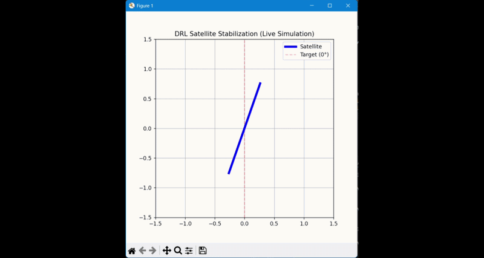
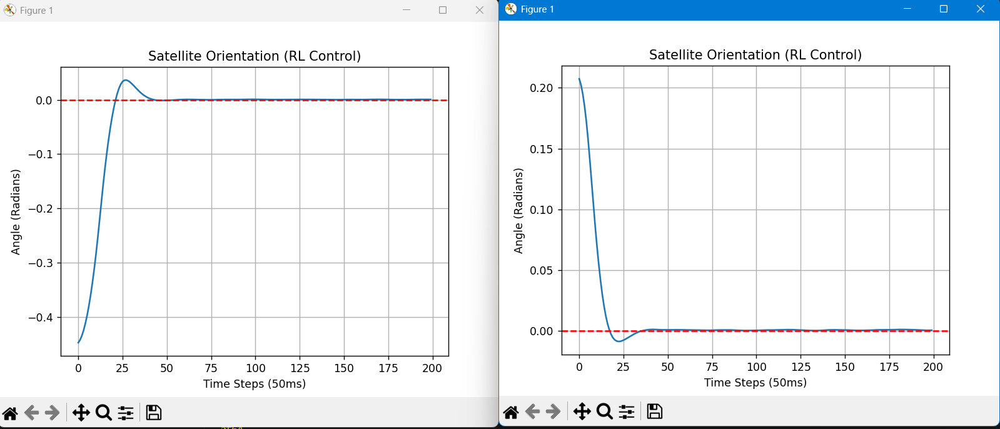

# Astro-Balance: Using DRL to keep Satellites Steady

I built this project because I wanted to see if **Deep Reinforcement Learning** could handle the same high-speed control problems that we usually solve with classical PIDs in Electrical Engineering.

This is a **Digital Twin** of a satellite's reaction wheel. The goal is simple: keep the satellite pointed at 0° (the red line) even when "Solar Wind" (random noise) tries to knock it off balance.

### 🎥 See it in action
 

### 📉 How well does it work?

As you can see in the graph, the AI usually figures out how to stop the wobbling in **less than 2 seconds**. It doesn't just stabilize; it does it efficiently because I programmed the "reward" to penalize it if it uses too much motor power.

---

### Why this matters for my Masters in Japan (SiC Smart Inverters)
I'm a final-year EE student heading to Japan to research **Silicon Carbide (SiC) Smart Inverters**. You might wonder: *What do satellites have to do with power inverters?*

Actually, the math is almost identical. 
* **In this project:** I'm using DRL to manage **Angular Momentum** to keep a satellite steady.
* **In Japan:** I'll be using DRL to manage **Virtual Inertia** to keep the power grid steady.

Both systems need high-speed micro-corrections and must be extremely energy efficient (to reduce heat in SiC switches). This simulator was my "sandbox" to prove that DRL can handle these non-linear dynamics better than traditional controllers.

### 🛠️ What's under the hood?
* **The Physics:** I built a custom `Gymnasium` environment from scratch using Newton's 2nd Law for Rotation.
* **The Brain:** I used the **PPO (Proximal Policy Optimization)** algorithm from `Stable-Baselines3`.
* **The Disturbance:** I added a "Solar Wind" factor to test **Robustness**. If the AI can't handle random noise, it’s not ready for space (or the power grid).

### 🏃 How to run it yourself
If you want to play with the simulation:
1. Grab the dependencies: `pip install gymnasium stable-baselines3 matplotlib numpy`
2. Run `train_astro.py` (It trains fast even on a standard laptop CPU).
3. Run `visualize_astro.py` to see the live animation.

---
*Created by Souvik ghosh | Electrical Engineering Student*
